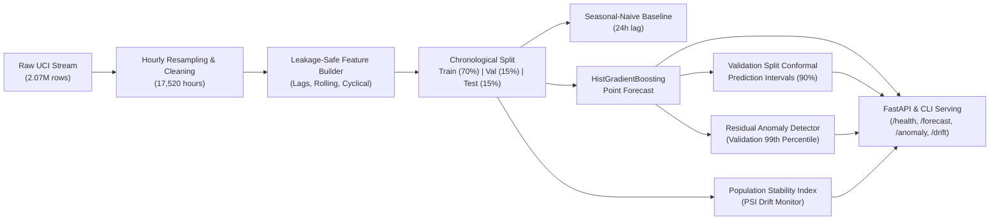

# Electricity Load Forecasting (`electricity-load-forecasting`)

[](https://github.com/owner/electricity-load-forecasting/actions/workflows/ci.yml)
[](https://www.python.org/)
[](LICENSE)
[](https://github.com/astral-sh/ruff)
[](https://fastapi.tiangolo.com)

A production-grade, CPU-friendly electricity load forecasting pipeline built on the [UCI Individual Household Electric Power Consumption dataset](https://archive.ics.uci.edu/static/public/235/individual+household+electric+power+consumption.zip).

---

## Architecture Overview



### Key Engineering Features
1. **CPU-Friendly Ingestion:** Streams the UCI semicolon-separated archive, resamples 2.07M minute readings into a contiguous 2-year (17,520 hours) hourly dataset. Data ingestion, feature engineering, and model training execute in under 7 seconds on a standard multi-core CPU.
2. **Leakage-Safe Design:**
   - Strict chronological train/validation/test partitions (`train_end < val_start < test_start`).
   - Rolling windows strictly shifted by 1 (`shift(1)`) so the current observation $y_t$ never contaminates feature computations.
   - All lag features $y_{t-k}$ enforce $k \ge 1$.
3. **Uncertainty Quantification:** Validation-calibrated split conformal prediction with finite-sample marginal coverage guarantees at 90% confidence ($1 - \alpha = 0.90$).
4. **Residual Anomaly Detection:** Flags operational consumption surges exceeding validation-calibrated residual quantiles, benchmarked with deterministic synthetic anomaly injection.
5. **PSI Drift Monitoring:** Monitors quantile shifts across 21 features and outputs, categorizing drift into stable ($<0.10$), moderate ($0.10-0.25$), and significant ($\ge 0.25$).
6. **Production Serving:** High-performance FastAPI application and unified CLI for training, serving, and benchmarking.

---

## Measured Experimental Results

All results below were empirically measured on the real UCI dataset (17,520 contiguous hourly samples from `2008-11-26 22:00:00` to `2010-11-26 21:00:00`).

### 1. Point Forecasting Performance (Test Set: 2,603 hours)

| Model | MAE (kW) | RMSE (kW) | MAPE (%) | sMAPE (%) | $R^2$ Score |
| :--- | :---: | :---: | :---: | :---: | :---: |
| **Seasonal-Naive Baseline (24h lag)** | 0.5127 | 0.7846 | 64.53% | 47.28% | -0.0949 |
| **HistGradientBoosting Forecaster** | **0.3243** | **0.4715** | **41.86%** | **33.79%** | **0.6045** |

> [!NOTE]
> The HistGradientBoosting model achieved a **36.76% reduction in MAE** over the seasonal-naive baseline and accounted for **60.45% of variance** ($R^2 = 0.6045$) without exogenous weather covariates.

### 2. Validation-Calibrated Conformal Prediction Intervals

| Metric | Target / Nominal | Measured Test Set Value |
| :--- | :---: | :---: |
| **Confidence Level ($1 - \alpha$)** | 90.00% | — |
| **Empirical Coverage** | $\ge 90.00\%$ | **89.17%** |
| **Mean Interval Width** | — | **1.3618 kW** |
| **Calibrated Quantile Error ($\hat{q}$)** | — | **0.7361 kW** |
| **Winkler Score (Interval Loss)** | — | **2.1176** |

### 3. Residual Anomaly Detection & Synthetic Benchmark

- **Anomaly Decision Threshold ($\tau$):** `1.5095 kW` (calibrated on 99th percentile of validation residuals).
- **Natural Test Set Detections:** 36 events (1.38% operational anomaly rate).

#### Synthetic Anomaly Evaluation Benchmark
> [!IMPORTANT]
> Because raw public historical data lacks hardware ground-truth logs, detection efficacy is evaluated via **deterministic synthetic anomaly injection** ($\pm 3.5\sigma$ perturbation at fixed pseudo-random indices with seed 42). This benchmark is strictly synthetic.

| Metric | Value |
| :--- | :---: |
| **Benchmark Classification** | `SYNTHETIC_INJECTED_EVALUATION` |
| **Injection Rate** | 3.0% (78 synthetic anomalies injected into 2,603 test samples) |
| **True Positives ($TP$)** | 42 |
| **False Positives ($FP$)** | 34 |
| **False Negatives ($FN$)** | 36 |
| **Synthetic Precision** | **0.5526** |
| **Synthetic Recall** | **0.5385** |
| **Synthetic F1-Score** | **0.5455** |

### 4. Population Stability Index (PSI) Drift Monitoring

- **Total Features Monitored:** 21
- **Stable Features ($\text{PSI} < 0.10$):** 14 features (`hour`, `hour_sin`, `hour_cos`, `dayofweek`, `dayofweek_sin`, `dayofweek_cos`, `is_weekend`, `day`, `lag_1h`, `lag_2h`, `lag_3h`, `lag_24h`, `lag_48h`, `lag_168h`)
- **Moderate Drift ($0.10 \le \text{PSI} < 0.25$):** 2 features (`rolling_mean_24h`: 0.1658, `rolling_std_24h`: 0.1776)
- **Significant Drift ($\text{PSI} \ge 0.25$):** 5 features (`month_sin`: 5.7065, `month`: 4.3305, `month_cos`: 3.5776, `rolling_mean_168h`: 1.0418, `rolling_std_168h`: 0.9496)
- **Root Cause Analysis:** The test split spans August 2010 to November 2010 (late summer through autumn), while the training set spans December 2008 to April 2010. The PSI monitor correctly alerted on calendar seasonality shift between partitions.

### 5. Latency Benchmarks (500 Iterations)

Measured on a standard CPU workstation:

| Pipeline Stage | Mean | Median (p50) | 95th Percentile (p95) | 99th Percentile (p99) |
| :--- | :---: | :---: | :---: | :---: |
| **Feature Extraction (1 step lookback)** | 0.623 ms | 0.589 ms | 0.773 ms | 1.061 ms |
| **Point Prediction (`HistGradientBoosting`)** | 0.704 ms | 0.729 ms | 0.860 ms | 0.954 ms |
| **Conformal Interval Generation** | 0.003 ms | 0.003 ms | 0.005 ms | 0.010 ms |
| **End-to-End Predict + Conformal** | 0.685 ms | 0.651 ms | 0.874 ms | 1.006 ms |
| **FastAPI `POST /forecast`** | 3.803 ms | 3.683 ms | 4.559 ms | 5.065 ms |
| **FastAPI `POST /anomaly`** | 1.752 ms | 1.666 ms | 2.255 ms | 2.598 ms |

---

## Quickstart & Installation

### 1. Installation
Clone the repository and install dependencies in editable mode:
```bash
pip install -r requirements.txt
pip install -e ".[dev]"
```

### 2. Run the Real Pipeline via CLI
Download the UCI dataset, clean, engineer features, train, calibrate, and generate JSON reports:
```bash
# Execute with live UCI dataset download
python -m electricity_load_forecasting.cli run

# Or run in offline deterministic synthetic mode (for CI or network-isolated environments)
python -m electricity_load_forecasting.cli run --offline
```

### 3. Run Latency Benchmarks
```bash
python benchmark.py
# or via CLI
python -m electricity_load_forecasting.cli benchmark --iterations 500
```

### 4. Run Test Suite
Run the 46 offline deterministic unit and integration tests:
```bash
pytest -v
```

### 5. Run Lint and Formatting Check
```bash
ruff check .
ruff format --check .
```

---

## FastAPI REST API

Start the API service:
```bash
python -m electricity_load_forecasting.cli serve --host 127.0.0.1 --port 8000
```

Interactive OpenAPI documentation is available at `http://127.0.0.1:8000/docs`.

### API Endpoints

#### 1. `GET /health`
Returns service and model calibration status.
```bash
curl -X GET http://127.0.0.1:8000/health
```
```json
{
  "status": "healthy",
  "version": "0.1.0",
  "model_fitted": true,
  "conformal_calibrated": true,
  "anomaly_detector_calibrated": true
}
```

#### 2. `POST /forecast`
Generates a point forecast with 90% conformal prediction intervals.
```bash
curl -X POST http://127.0.0.1:8000/forecast \
  -H "Content-Type: application/json" \
  -d '{
    "recent_history": [1.2, 1.3, 1.1, ..., 1.4],
    "forecast_timestamp": "2026-10-05T14:00:00"
  }'
```
```json
{
  "point_forecast": 1.1389,
  "lower_bound": 0.4028,
  "upper_bound": 1.8750,
  "confidence_level": 0.9,
  "quantile_error": 0.7361,
  "unit": "kW"
}
```

#### 3. `POST /anomaly`
Evaluates whether an observed consumption level is anomalous.
```bash
curl -X POST http://127.0.0.1:8000/anomaly \
  -H "Content-Type: application/json" \
  -d '{
    "actual_load": 12.5,
    "predicted_load": 1.20
  }'
```
```json
{
  "is_anomaly": true,
  "residual": 11.3,
  "threshold": 1.5095,
  "severity_ratio": 7.4859,
  "message": "Residual 11.3000 kW exceeds threshold 1.5095 kW."
}
```

#### 4. `GET /drift`
Retrieves the latest Population Stability Index (PSI) drift report.
```bash
curl -X GET http://127.0.0.1:8000/drift
```

---

## Directory Structure

```text
electricity-load-forecasting/
├── .github/
│   └── workflows/
│       └── ci.yml                 # Matrix CI testing Python 3.11 & 3.12
├── configs/
│   └── config.yaml               # Centralized hyperparameters & paths
├── reports/
│   └── pipeline_results.json     # Saved pipeline execution output
├── scripts/
│   └── api_smoke_test.py         # Automated API smoke test script
├── src/
│   └── electricity_load_forecasting/
│       ├── __init__.py
│       ├── anomaly.py            # Residual detector & synthetic evaluation
│       ├── api.py                # FastAPI REST service
│       ├── cleaning.py           # Schema validation & interpolation
│       ├── cli.py                # CLI commands (run, serve, benchmark)
│       ├── config.py             # Dataclass config manager
│       ├── data.py               # Downloader & hourly resampling
│       ├── drift.py              # PSI drift monitoring
│       ├── features.py           # Leakage-safe lag, rolling, cyclical
│       ├── intervals.py          # Split conformal prediction intervals
│       ├── metrics.py            # Forecast & interval evaluation metrics
│       ├── models.py             # Baseline & HistGradientBoosting
│       ├── pipeline.py           # End-to-end execution runner
│       └── split.py              # Chronological train/val/test split
├── tests/
│   ├── conftest.py               # Shared test fixtures
│   ├── test_anomaly.py           # Anomaly detector tests
│   ├── test_api.py               # FastAPI endpoint tests
│   ├── test_baseline.py          # Seasonal-naive baseline tests
│   ├── test_cleaning.py          # Data cleaning & schema tests
│   ├── test_drift.py             # PSI calculation & drift monitor tests
│   ├── test_features.py          # Feature engineering unit tests
│   ├── test_intervals.py         # Conformal interval calibration tests
│   ├── test_leakage.py           # Strict leakage-safety verification tests
│   ├── test_metrics.py           # Metrics computation tests
│   ├── test_models.py            # Forecaster wrapper tests
│   └── test_pipeline.py          # Offline integration pipeline tests
├── benchmark.py                  # Latency & throughput benchmark
├── MODEL_CARD.md                 # Formal model card documentation
├── pyproject.toml                # Project metadata & build tool configuration
├── requirements.txt              # Pinned requirements
├── LICENSE                       # MIT License
├── .gitignore                    # Git ignore (raw data & joblib excluded)
└── README.md                     # Project documentation
```

---

## Limitations & Production Considerations

1. **Single Household Footprint:** The dataset reflects a single residential home in Sceaux, France (2006–2010). Spatial generalization to industrial plants or commercial grids requires local fine-tuning.
2. **Absence of Weather Covariates:** Temperature, solar irradiance, and wind speed have strong causal impacts on heating/cooling demand. Integrating weather APIs will further reduce residual spikes.
3. **Marginal vs. Conditional Conformal Coverage:** Split conformal prediction guarantees marginal coverage on average across the entire evaluation horizon. Minor conditional coverage variation may occur during seasonal transitions.
4. **Data Privacy & Governance:** In accordance with repository policies, raw data files (`data/raw/`) and serialized model binaries are explicitly excluded from version control via `.gitignore`.
